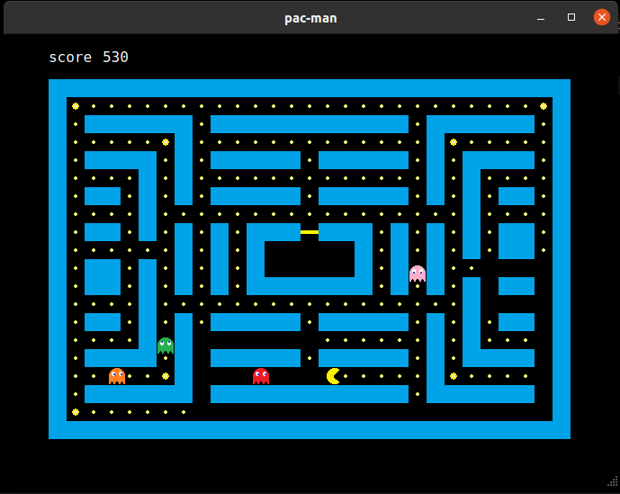

# Qt Pac-Man

A classic **Pac-Man** game built using **Qt Creator**. Navigate through the maze, eat pellets, and avoid ghosts!

### **Controls**
- **W** - Move Up  
- **A** - Move Left  
- **S** - Move Down  
- **D** - Move Right  



---

## **Development Details**
This project is developed using **Qt 6.2.1**. If you're using a different Qt 6 version, you may need to uncomment certain lines in the `Qt-pac-man.pro` file.

**Environment:**  
- **Qt Version:** Qt 6.2.1 GCC 64bit  
- **ABI:** x86-linux-generic-elf-64bit  
- **Source Path:** `/opt/Qt/6.2.1/gcc_64`  
- **mkspec:** linux-g++  

---

## **Using the Pac-Man Game API**
For a deeper look into the implementation, refer to:
- [`mainwindow.cpp`](https://github.com/blueskyson/Qt-pac-man/blob/master/source/mainwindow.cpp)
- [`mainwindow.h`](https://github.com/blueskyson/Qt-pac-man/blob/master/source/mainwindow.h)

### **Step 1: Declare Objects & Functions**
To integrate the game into a `QMainWindow`:
- Add a `QGraphicsView` (`graphicsView`) for displaying the game. (Defined in [`mainwindow.ui`](https://github.com/blueskyson/Qt-pac-man/blob/master/mainwindow.ui))
- Add `QLabel`s for score (`score`), game-over messages (`win_label`, `lose_label`).
- Use a `QTimer` (`score_timer`) to update scores.
- Declare `keyPressEvent` for handling key inputs.
- Implement the `update_score` slot function.
- Include [`game.h`](https://github.com/blueskyson/Qt-pac-man/blob/master/source/game.h).

### **Step 2: Initialize Objects**
Set up the game window in `MainWindow` constructor:

```cpp
MainWindow::MainWindow(QWidget *parent)
    : QMainWindow(parent), ui(new Ui::MainWindow)
{
    ui->graphicsView->setStyleSheet("QGraphicsView {border: none;}");
    ui->graphicsView->setBackgroundBrush(Qt::black);
    ui->graphicsView->setFocusPolicy(Qt::NoFocus);
```

Define map size and load map data:

```cpp
    int map_height = 20, map_width = 29;
    int x = 50, y = 50;
    int w = (map_width * GameObject::Width);
    int h = (map_height * GameObject::Width);
    ui->graphicsView->setGeometry(x, y, w, h);
    game = new Game(x, y, map_width, map_height, ":/game_objects/map_objects/map.txt");
    ui->graphicsView->setScene(game);
```

Initialize labels and timers:

```cpp
    score = new QLabel(this);
    win_label = new QLabel(this);
    lose_label = new QLabel(this);
    score_timer = new QTimer(this);
```

Start the game loop:

```cpp
    score_timer->start(25);
    connect(score_timer, SIGNAL(timeout()), this, SLOT(update_score()));
    game->start();
}
```

### **Step 3: Implement Score & Key Handling**

#### **Updating Score**
```cpp
void MainWindow::update_score()
{
    score->setText(QString::number(game->get_score()));
    if (game->stat == Game::Win) {
        win_label->show();
        score_timer->stop();
    } else if (game->stat == Game::Lose) {
        lose_label->show();
        score_timer->stop();
    }
}
```

#### **Handling Key Press Events**
```cpp
void MainWindow::keyPressEvent(QKeyEvent *e)
{
    switch (e->key()) {
    case Qt::Key_W:
        game->pacman_next_direction(GameObject::Up);
        break;
    case Qt::Key_A:
        game->pacman_next_direction(GameObject::Left);
        break;
    case Qt::Key_S:
        game->pacman_next_direction(GameObject::Down);
        break;
    case Qt::Key_D:
        game->pacman_next_direction(GameObject::Right);
        break;
    }
}
```

---

## **Customizable Game Parameters**
The following parameters can be adjusted in [`game.h`](https://github.com/blueskyson/Qt-pac-man/blob/master/source/game.h):

```cpp
#define BALL_SCORE       10     // Score for regular pellets
#define POWERBALL_SCORE  30     // Score for power pellets
#define GHOST_SCORE      50     // Score for eating ghosts
#define INTERVAL         10     // Movement interval for Pac-Man
#define NORMAL_INTERVAL  10     // Movement interval for ghosts (normal state)
#define PANNIC_INTERVAL  15     // Movement interval for scared ghosts
#define RUNNING_INTERVAL 5      // Movement interval for running ghosts
#define PANNIC_TIME      1000   // Duration of scared state
#define FLASH_INTERVAL   200    // Blinking interval for power pellets
```

You can also adjust the ghost release timing in [`game.cpp`](https://github.com/blueskyson/Qt-pac-man/blob/master/source/game.cpp):

```cpp
int GHOST_RELEASE_TIME[] = {0, 200, 400, 600};  // Time before ghosts exit the cage
```

---

## **How to Run the Game**
1. **Clone the repository:**
   ```sh
   git clone https://github.com/yourusername/Qt-pac-man.git
   cd Qt-pac-man
   ```

2. **Open with Qt Creator:**
   - Load `Qt-pac-man.pro` in Qt Creator.
   - Configure Qt 6.2.1 (or modify as needed).

3. **Build and Run:**
   - Click **Run** in Qt Creator, or execute the built binary from the terminal.

---

## **Contributing**
Feel free to fork the repository and submit pull requests for improvements. Suggestions and bug reports are welcome!


